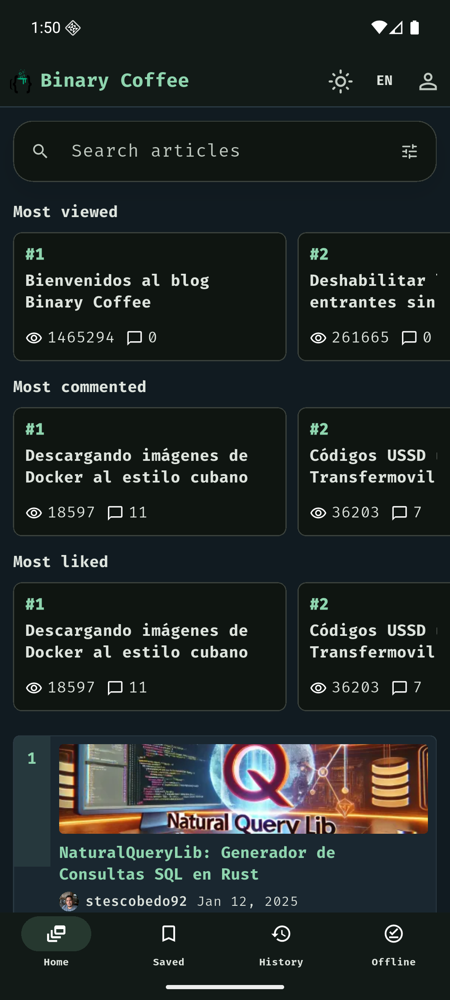
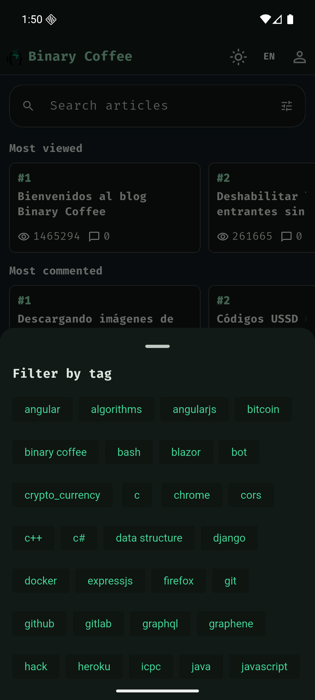
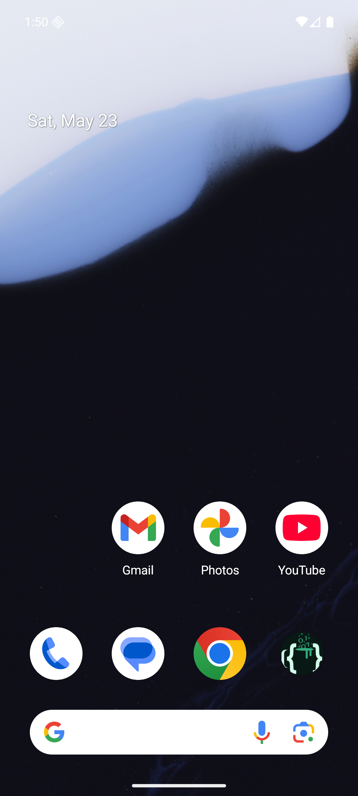

# Binary Coffee Mobile

<p align="center">
  
</p>

Binary Coffee Mobile is a Flutter application for reading and interacting with
articles from [binarycoffee.dev](https://binarycoffee.dev). It uses the same
Binary Coffee GraphQL API consumed by the browser extension, then adapts the
experience for Android, macOS, Windows, and Linux.

The app is designed as a technical reading client: compact article cards,
highlight rails, GitHub authentication, comments, likes, saved articles,
offline reading, reading history, tag filters, article sharing, and a
dark-first Binary Coffee visual style.

## Screenshots

<p>
  
  
  
</p>

<p>
  
  
</p>

## What It Does

- Lists Binary Coffee articles using `https://api.binarycoffee.dev/graphql`.
- Supports paginated loading, search, author filtering, and multi-tag filters.
- Shows highlighted sections for most viewed, most commented, and most liked
  posts.
- Opens full Markdown article detail with banner, author, metrics, comments,
  and reading mode.
- Lets users save articles locally and read cached articles offline.
- Tracks read history and recent searches on device.
- Supports native sharing for article URLs.
- Supports GitHub authentication through the Binary Coffee dashboard OAuth
  flow.
- Allows authenticated actions such as likes, comments, drafts, profile stats,
  and subscription where the API permits them.
- Uses English by default and includes an in-app `EN/ES` language switch.
- Uses a dark theme by default, with light/dark theme switching.
- Switches the Android launcher icon between light and dark variants based on
  the selected app theme.
- Registers deep links for Binary Coffee article URLs.

## Design

The UI follows the Binary Coffee identity and adapts it to mobile:

- Fira Code typography.
- Dark-first terminal/editorial layout.
- Binary Coffee green accents.
- Compact top and bottom navigation.
- Adaptive Android launcher icons for light and dark themes.
- Material 3 controls with platform-friendly behavior.

## Requirements

- Flutter SDK
- Dart SDK bundled with Flutter
- Android Studio or Android command line tools for Android builds
- Xcode for macOS builds
- Linux build dependencies for Linux packages
- Visual Studio Build Tools for Windows builds

Check your local setup with:

```bash
flutter doctor
```

## Installation

Clone the repository and install dependencies:

```bash
git clone <repository-url>
cd binary-coffee-mobile
flutter pub get
```

Run static analysis and tests:

```bash
flutter analyze
flutter test
```

Run the app on a connected device or emulator:

```bash
flutter run
```

Run on a specific Android emulator:

```bash
flutter devices
flutter run -d emulator-5554
```

## Android Emulator Notes

The app was tested with a Pixel emulator. If the emulator does not show a
software keyboard, enable it with:

```bash
adb shell settings put secure show_ime_with_hard_keyboard 1
```

The GitHub login opens inside an embedded WebView, so the emulator does not
need a Google account just to authenticate with GitHub.

## GitHub Authentication

Authentication uses the Binary Coffee dashboard GitHub provider flow. The app
opens GitHub OAuth and receives the session token through the
`binarycoffee://auth` deep link.

The app does not expose manual JWT or GitHub code fields in the UI. Users sign
in with their GitHub account only.

## Build Commands

Android APK:

```bash
flutter build apk --release
```

macOS:

```bash
flutter build macos --release
```

Windows:

```bash
flutter build windows --release
```

Linux:

```bash
flutter build linux --release
```

Desktop builds must be produced on their native operating system.

### macOS Gatekeeper

The macOS release artifact must be signed with an Apple Developer ID
certificate and notarized by Apple. If the signing secrets are not configured,
the workflow still produces a development DMG, but macOS Gatekeeper can show
`"Binary Coffee" Not Opened` after download.

For local testing of an unsigned development build, copy the app to
`/Applications` and remove the quarantine attribute:

```bash
sudo xattr -dr com.apple.quarantine "/Applications/Binary Coffee.app"
open "/Applications/Binary Coffee.app"
```

For public distribution, configure these GitHub Actions secrets:

- `MACOS_CERTIFICATE_BASE64`
- `MACOS_CERTIFICATE_PASSWORD`
- `MACOS_KEYCHAIN_PASSWORD`
- `APPLE_ID`
- `APPLE_APP_SPECIFIC_PASSWORD`
- `APPLE_TEAM_ID`

## Release Artifacts

GitHub Actions workflows are configured to build and package:

- Android `.apk`
- macOS `.dmg`
- Windows `.exe`
- Linux `.deb`

Release workflows publish artifacts when a version tag is pushed.

## Project Structure

```text
lib/
  main.dart                         Main Flutter UI and navigation
  src/api/binary_coffee_api.dart    GraphQL API client
  src/models/                       Article, author, tag, session models
  src/state/                        App state and local persistence

assets/
  fonts/                            Fira Code fonts
  images/                           App icon, logo, fallback imagery

android/
macos/
windows/
linux/                              Platform runners and packaging targets

docs/screenshots/                   README screenshots
```

## Useful Development Commands

```bash
flutter pub get
flutter analyze
flutter test
flutter run -d emulator-5554
flutter build apk --debug
```

## Notes

- The app defaults to English, but users can switch to Spanish from the `EN/ES`
  button in the top bar.
- The default theme is dark.
- Offline reading is based on locally cached articles that the user has opened
  or saved.
- Like state is tracked locally because the public read API does not currently
  expose a reliable `likedByMe` query.
